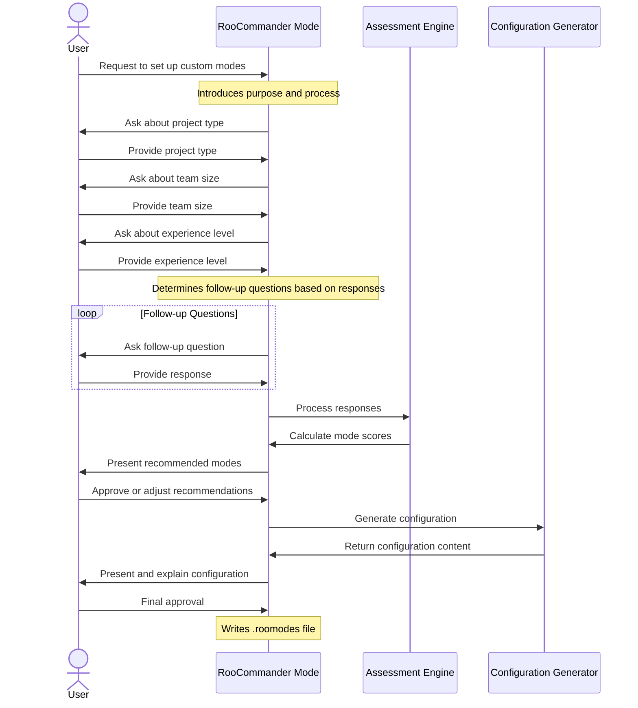
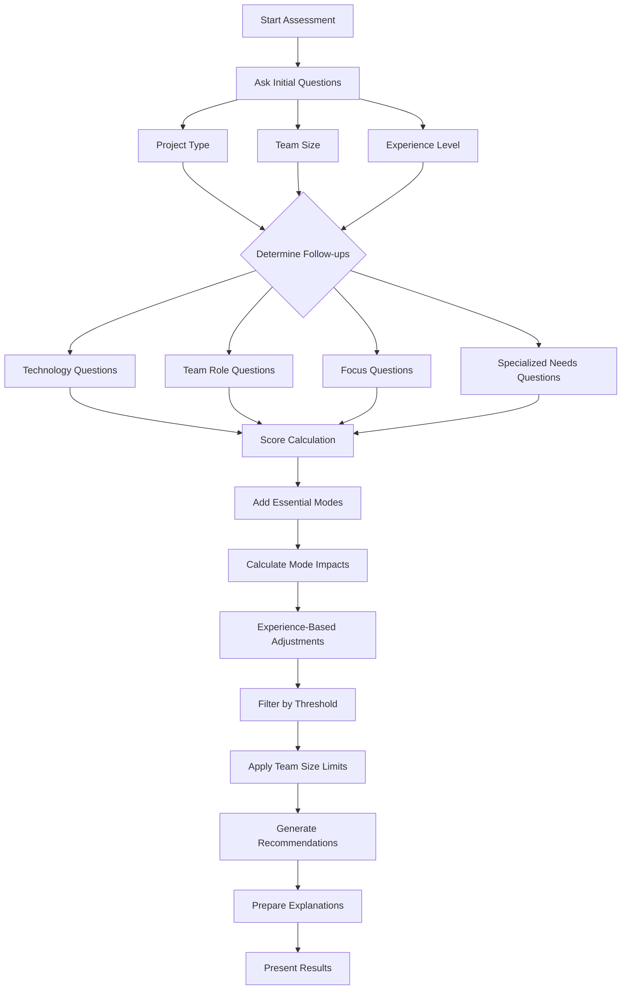
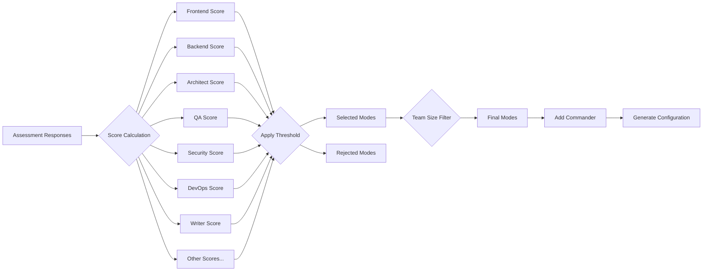
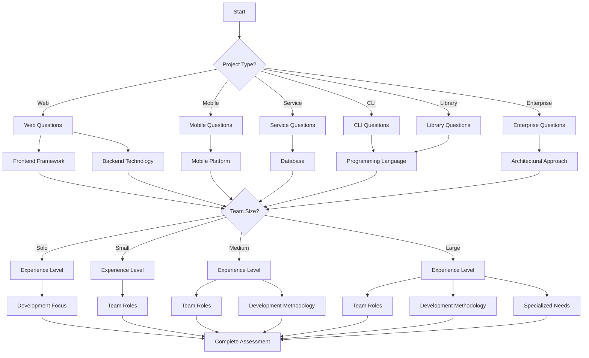
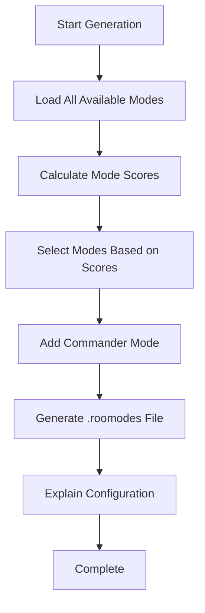

# RooCommander User Flow

This document outlines the typical conversation flow between a user and the RooCommander mode, illustrating how the assessment, recommendation, and configuration generation process works.

## Conversation Flow



## Assessment Logic Flow



## Mode Selection Process



## Question Branching Logic



## Configuration Generation



## RooCommander Decision Tree

```mermaid
graph TD
    A[User Request] --> B{Project Type}
    B -->|Web| C1[Web Flow]
    B -->|Mobile| C2[Mobile Flow]
    B -->|Service| C3[Service Flow]
    B -->|CLI| C4[CLI Flow]
    B -->|Library| C5[Library Flow]
    B -->|Enterprise| C6[Enterprise Flow]
    
    C1 --> D1{Frontend?}
    D1 -->|React| E1[React]
    D1 -->|Vue| E2[Vue]
    D1 -->|Angular| E3[Angular]
    D1 -->|Other| E4[Other]
    
    C1 --> D2{Backend?}
    D2 -->|Node| F1[Node]
    D2 -->|Python| F2[Python]
    D2 -->|Java| F3[Java]
    D2 -->|Other| F4[Other]
    
    E1 & E2 & E3 & E4 & F1 & F2 & F3 & F4 --> G{Team Size}
    C2 & C3 & C4 & C5 & C6 --> G
    
    G -->|Solo| H1[Solo Flow]
    G -->|Small| H2[Small Team Flow]
    G -->|Medium| H3[Medium Team Flow]
    G -->|Large| H4[Large Team Flow]
    
    H1 & H2 & H3 & H4 --> I{Experience Level}
    
    I -->|Beginner| J1[Learning Focus]
    I -->|Intermediate| J2[Dev Focus]
    I -->|Advanced| J3[Specialized Needs]
    I -->|Mixed| J4[Learning Support]
    
    J1 & J2 & J3 & J4 --> K[Calculate Recommendations]
    K --> L[Generate Configuration]