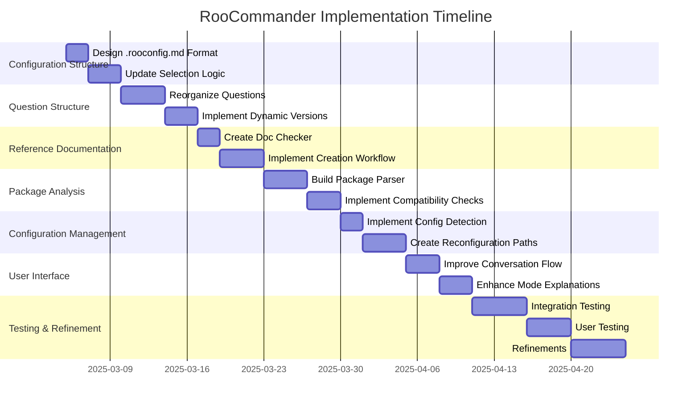

# RooCommander Implementation Plan

This document outlines the step-by-step plan for implementing the revised RooCommander approach, focusing on the "What-How-What" structure and improved configuration persistence.

## Phase 1: Configuration Structure Updates

### 1. Create Configuration Persistence Format
- **Task**: Design the `.rooconfig.md` file structure
- **Purpose**: Store user responses and configuration history
- **Components**:
  - Project profile section (language, frameworks, project type)
  - Team structure section
  - Selected modes
  - Configuration history

### 2. Update Mode Selection Logic
- **Task**: Revise the scoring and selection algorithm in `generator.js`
- **Purpose**: Prioritize technology-specific modes
- **Changes**:
  - Add framework version-specific scoring
  - Update threshold logic
  - Modify team size constraints
  - Implement experience-level adjustments

## Phase 2: Question Structure Overhaul

### 1. Reorganize Assessment Questions
- **Task**: Restructure `questions.json` with the "What-How-What" flow
- **Purpose**: Prioritize technology identification before team structure
- **Implementation**:
  - Group questions into phases
  - Update follow-up logic
  - Add framework version selection

### 2. Implement Dynamic Framework Version Questions
- **Task**: Create mechanism for dynamically generating version options
- **Purpose**: Show only versions with reference documentation
- **Components**:
  - Reference doc directory scanner
  - Version extraction logic
  - Dynamic option generation

## Phase 3: Reference Documentation Integration

### 1. Reference Doc Availability Checker
- **Task**: Create utility to check for matching reference docs
- **Purpose**: Identify documentation gaps
- **Implementation**:
  - Scan reference-docs directory
  - Match against user-selected technologies
  - Generate missing documentation list

### 2. Documentation Creation Workflow
- **Task**: Implement tiered approach to documentation creation
- **Purpose**: Help users create missing reference docs
- **Options**:
  - Automated creation via ask_perplexity
  - Guided manual creation with templates
  - Skip with reduced functionality

## Phase 4: Package Analysis Implementation

### 1. Package File Parser
- **Task**: Create utility to parse different package file formats
- **Purpose**: Extract dependencies and versions
- **Supported Formats**:
  - package.json (JavaScript/Node)
  - requirements.txt (Python)
  - pom.xml/build.gradle (Java)
  - csproj/packages.config (.NET)
  - Other common formats

### 2. Compatibility Analysis Logic
- **Task**: Implement flexible compatibility checking
- **Purpose**: Identify potential issues without rigid enforcement
- **Components**:
  - Version range parser
  - Compatibility rule engine
  - Warning/error classification

## Phase 5: Configuration Management

### 1. Configuration Detection
- **Task**: Implement logic to detect existing configuration files
- **Purpose**: Support reconfiguration scenarios
- **Implementation**:
  - Scan for `.rooconfig.md` file
  - Parse previous configuration
  - Assess configuration age/relevance

### 2. Reconfiguration Workflows
- **Task**: Create separate paths for minor vs. major changes
- **Purpose**: Streamline updates without repetitive questioning
- **Implementation**:
  - Change classification logic
  - Targeted question subsets for minor changes
  - Full reassessment with context for major changes

## Phase 6: User Interface Enhancements

### 1. Conversation Flow Improvements
- **Task**: Enhance RooCommander dialog to match revised flow
- **Purpose**: Provide a smoother, more logical conversation
- **Components**:
  - Introduction improvements
  - Phase transition explanations
  - Configuration summary presentation

### 2. Mode Explanation Enhancements
- **Task**: Improve mode recommendation explanations
- **Purpose**: Help users understand technology-specific benefits
- **Implementation**:
  - Technology-specific explanation generator
  - Mode combination synergy explanations
  - Reference documentation linking

## Implementation Timeline

## Development Approach

1. **Iterative Implementation**: Implement one phase at a time, testing thoroughly before proceeding
2. **Backward Compatibility**: Ensure revised approach doesn't break existing configurations
3. **Documentation First**: Update documentation before implementing each component
4. **Test-Driven Development**: Create test cases before implementing features

## Success Metrics

- **Usability**: Reduction in clarification questions during setup
- **Accuracy**: Improved relevance of recommended modes to project needs
- **Efficiency**: Reduced time to generate appropriate configurations
- **Flexibility**: Successful handling of diverse technology stacks
- **Maintenance**: Ease of updating configurations as projects evolve

By following this implementation plan, the RooCommander will transition to a technology-first approach that creates more tailored, relevant mode configurations while supporting the entire project lifecycle through reconfiguration capabilities.