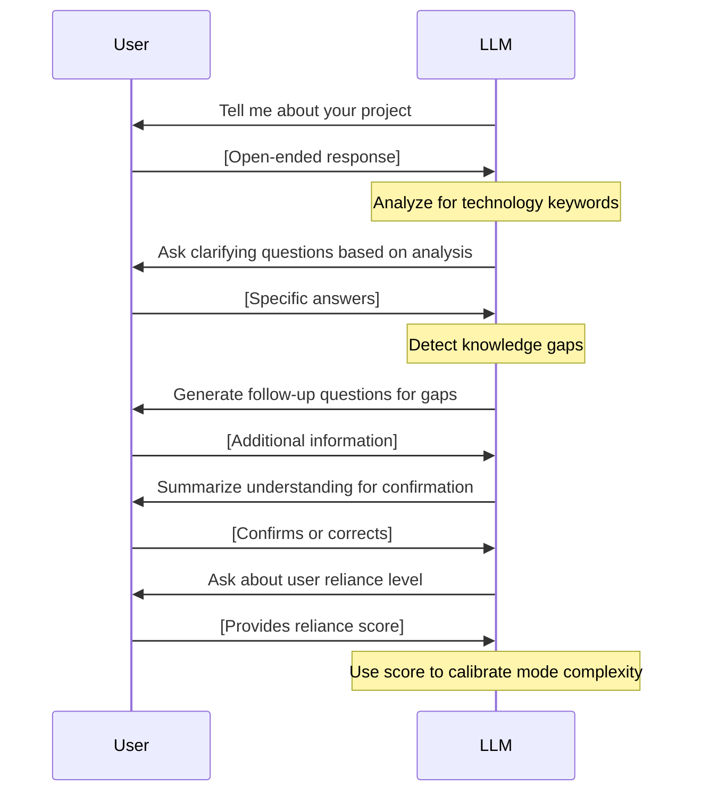
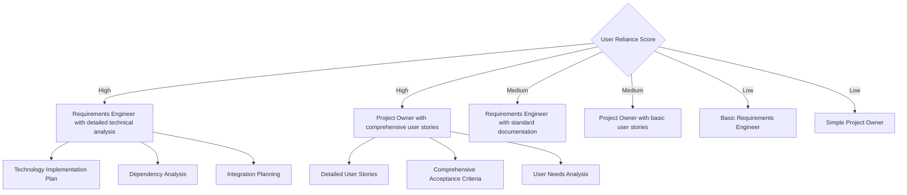
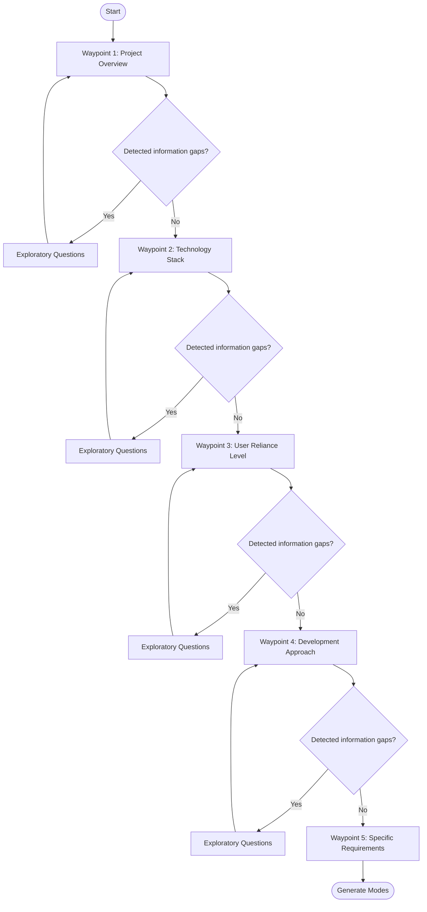

# RooCommander Hybrid Mode Architecture: Lifecycle + Technology

## Overview

This document outlines a comprehensive revision to the RooCommander mode generation approach, creating a hybrid system that combines development lifecycle stages with technology-specific expertise. This approach addresses several issues discovered during testing while aligning with the core architecture of Roo's built-in modes.

## Key Changes

1. **Conversational Assessment Enhancement**
2. **User Reliance Calibration System**
3. **Hybrid Technology-Lifecycle Mode Structure**
4. **Enhanced Requirements Engineering**
5. **Adaptive Pathfinding with Waypoints**

## 1. Conversational Assessment Enhancement

### Problem
The prior assessment approach was too rigid and formulaic, causing users to feel like they were filling out a survey rather than having a conversation.

### Solution
Implement a more natural, conversational flow for assessment with:

- Open-ended initial questions
- Adaptive follow-up based on initial responses
- Dynamic exploration of topics based on project needs
- Periodic summaries for confirmation
- LLM-driven question generation based on detected ambiguities

### Conversational Flow



## 2. User Reliance Calibration System

### Problem
Previous implementations didn't account for varying levels of user reliance on Roo-Coder, resulting in either too much or too little guidance.

### Solution
Add a specific question to gauge reliance levels:

> On a scale from 1-10, how much do you intend to rely on Roo-Coder for the development of this project?

The response calibrates:
- Mode complexity and detail level
- Number of expertise areas generated
- Depth of guidance in custom instructions
- Requirements engineering and project owner mode sophistication

### Reliance Impact Map

```mermaid
graph TD
    RelianceScore[User Reliance Score] --> ModeComplexity[Mode Complexity/Detail]
    RelianceScore --> ExpertiseCount[Number of Expertise Areas]
    RelianceScore --> GuidanceDepth[Guidance Depth in Instructions]
    RelianceScore --> RequirementsEngDetail[Requirements Engineering Detail]
    RelianceScore --> ProjectOwnerDetail[Project Owner Detail]
    
    ModeComplexity --> Low1[Low: Minimal guidance]
    ModeComplexity --> Medium1[Medium: Balanced guidance]
    ModeComplexity --> High1[High: Comprehensive guidance]
    
    ExpertiseCount --> Low2[Low: Core modes only]
    ExpertiseCount --> Medium2[Medium: Core + selected specialized]
    ExpertiseCount --> High2[High: Full lifecycle coverage]
    
    GuidanceDepth --> Low3[Low: Basic instructions]
    GuidanceDepth --> Medium3[Medium: Standard practices]
    GuidanceDepth --> High3[High: Detailed best practices]
    
    RequirementsEngDetail --> Low4[Low: Basic requirements]
    RequirementsEngDetail --> Medium4[Medium: Standard documentation]
    RequirementsEngDetail --> High4[High: Comprehensive analysis]
    
    ProjectOwnerDetail --> Low5[Low: Simple features]
    ProjectOwnerDetail --> Medium5[Medium: Standard user stories]
    ProjectOwnerDetail --> High5[High: Detailed acceptance criteria]
```



## 3. Hybrid Technology-Lifecycle Mode Structure

### Problem
Previous mode structures either:
1. Created too many technology-specific modes (rails-dev, rails-api, rails-ui), or
2. Created generic lifecycle modes without technology-specific knowledge

### Solution
Implement a hybrid approach inspired by community-submitted modes (e.g., Jest Test Engineer) that combines:
- Core development lifecycle roles
- Technology-specific expertise
- Precise file pattern permissions
- Tailored custom instructions

### Mode Architecture

```mermaid
graph TD
    subgraph Development Lifecycle
        Strategist[Project Strategist]
        Architect[Solution Architect]
        Developer[Lead Developer]
        Tester[Quality Guardian]
        DevOps[DevOps Orchestrator]
    end
    
    subgraph Technology Context
        TechStack[[Technology Stack]]
        Frameworks[[Frameworks]]
        Tools[[Tools]]
        Patterns[[Patterns]]
    end
    
    subgraph Generated Modes
        TechArch["{Tech}-Architect"]
        TechDev["{Tech}-Developer"]
        TechTest["{Tech}-Tester"]
        TechDevOps["{Tech}-DevOps"]
    end
    
    Architect --> TechArch
    Developer --> TechDev
    Tester --> TechTest
    DevOps --> TechDevOps
    
    TechStack --> TechArch
    TechStack --> TechDev
    TechStack --> TechTest
    TechStack --> TechDevOps
    
    Frameworks --> TechArch
    Frameworks --> TechDev
    Frameworks --> TechTest
    Frameworks --> TechDevOps
    
    Tools --> TechArch
    Tools --> TechDev
    Tools --> TechTest
    Tools --> TechDevOps
    
    Patterns --> TechArch
    Patterns --> TechDev
    Patterns --> TechTest
    Patterns --> TechDevOps
    
    Strategist --> ReqEng[Requirements Engineer]
    Strategist --> ProjOwner[Project Owner]
```



### Mode Generation Example: Rails Tester

```json
{
  "slug": "rails-tester",
  "name": "Rails Test Engineer",
  "roleDefinition": "You are Roo, a Rails testing specialist with deep expertise in RSpec, MiniTest, Capybara, and Rails-specific testing patterns...",
  "groups": [
    "read",
    "browser",
    "command",
    ["edit", {
      "fileRegex": "(spec/.*|test/.*|\\.spec\\.rb$|\\.test\\.rb$)",
      "description": "Test files and test configuration"
    }]
  ],
  "customInstructions": "When writing Rails tests: Use describe/it blocks for clear organization..."
}
```

## 4. Enhanced Requirements Engineering

### Problem
Previous implementations lacked sufficient requirements engineering capabilities, particularly for high-reliance users who need more technical guidance.

### Solution
Implement dual specialized modes that are calibrated by user reliance score:

1. **Requirements Engineer**: Focuses on technical implementation details
   - Package/dependency selection and evaluation
   - System requirements documentation
   - Technical constraints analysis
   - Integration planning

2. **Project Owner**: Focuses on feature requirements
   - User story creation
   - Acceptance criteria definition
   - Feature prioritization
   - User needs analysis

### Requirements Engineering Flow



## 5. Adaptive Pathfinding with Waypoints

### Problem
Previous assessment processes were too rigid, forcing users through a predetermined path regardless of context.

### Solution
Implement a "waypoint" system that:
- Defines essential assessment points that must be reached
- Allows creative exploration between waypoints
- Enables the LLM to add questions where gaps are detected
- Ensures return to the core assessment path after exploratory branches

### Waypoint Navigation



## Implementation Strategy

### Phase 1: Pre-Conversation Enhancement
- Add conversational opener
- Implement user reliance question
- Create waypoint navigation system

### Phase 2: Hybrid Mode Architecture
- Develop technology-lifecycle mode templates
- Create mode calibration system based on reliance scores
- Implement file pattern restrictions

### Phase 3: Requirements Engineering
- Enhance requirements engineer mode
- Develop project owner mode
- Implement reliance-based calibration

### Phase 4: Testing and Validation
- Create test cases for various project types
- Validate conversational flow
- Verify mode generation accuracy

## Expected Outcomes

The hybrid mode architecture will:
1. Create more focused, useful custom modes
2. Reduce mode proliferation while maintaining technology expertise
3. Provide appropriate guidance based on user needs
4. Create a more natural, conversational assessment experience
5. Generate complementary modes that cover the full development lifecycle

This approach aligns with Roo's core architecture while delivering a focused, development-cycle oriented set of modes that better supports diverse project goals.