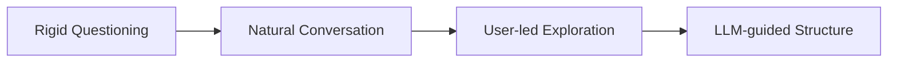
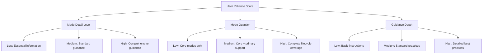
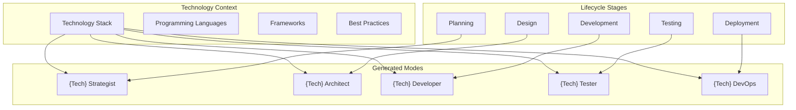
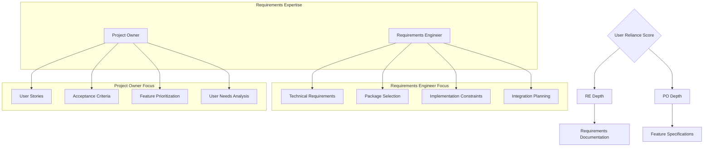
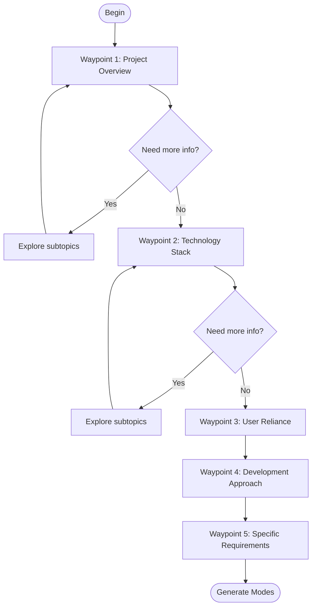

# RooCommander Round 5 Implementation Plan

## Overview

This document outlines the conceptual approach for implementing the RooCommander improvements, focusing on key concepts rather than implementation specifics.

## Core Conceptual Changes

### 1. Conversational Engagement Model

The RooCommander will shift from a questionnaire-style interaction to a natural conversation:



**Key Elements:**
- Begin with open-ended project exploration
- Let user speak freely about their project
- LLM extracts key information without rigid structure
- Transition smoothly between topics with natural language
- Explicitly acknowledge and validate user responses

### 2. User Reliance Calibration System

A new calibration system based on the question:
> "On a scale from 1-10, how much do you intend to rely on Roo-Coder for this project?"



The LLM uses this score to adapt its entire approach, creating a personalized experience that matches the user's needs for support.

### 3. Hybrid Technology-Lifecycle Mode Structure

Replace both:
- Overly specialized technical modes (rails-api, rails-ui, etc.)
- Generic lifecycle modes lacking technical context

With a hybrid approach that merges development lifecycle stages with technology expertise:



This approach gives the LLM a clear conceptual framework for generating modes that are both focused on development lifecycle stages and infused with technology-specific knowledge.

### 4. Requirements Expertise Enhancement

Reintroduce and enhance requirements expertise with two complementary angles calibrated by user reliance:



For high-reliance users, these modes provide comprehensive guidance. For low-reliance users, they offer basic templates and structure.

### 5. Waypoint Navigation System

Replace linear questioning with a flexible waypoint system:



The LLM is instructed to:
- Ensure all waypoints are visited
- Determine the best path between waypoints
- Freely explore relevant subtopics when needed
- Generate appropriate questions based on context
- Return to the main path after exploration

## Conceptual Implementation Approach

### 1. LLM Instruction Enhancement

Rather than providing rigid scripts, we give the LLM conceptual frameworks and guidance:

1. **Conceptual Frameworks:**
   - Development lifecycle stages and their characteristics
   - Technology-specific patterns and considerations
   - User reliance impact on guidance detail

2. **Behavioral Guidance:**
   - Be conversational rather than interrogative
   - Present exactly one question at a time
   - Confirm understanding periodically
   - Adapt question depth based on project complexity
   - Use natural language transitions between topics

3. **Decision-Making Guidelines:**
   - When to explore subtopics vs. continue main assessment
   - How to calibrate mode complexity based on reliance score
   - Which expertise areas to recommend based on project needs
   - How to inject technology context into lifecycle modes

### 2. Configuration Templates

Templates for both:

1. **Mode Structure Templates:**
   - Technology-lifecycle hybrid mode structures
   - Requirements expertise structures
   - Support mode structures

2. **Output Templates:**
   - New configuration format without team structure
   - Technology-specific role definitions
   - Reliance-calibrated custom instructions

### 3. Conversation Design

Deliberate conversation patterns that feel natural while gathering necessary information:

```
LLM: Tell me about your project. What are you looking to build?
User: [Open-ended response]

LLM: That sounds interesting! Could you tell me more about [aspect needing elaboration]?
User: [Additional details]

LLM: Based on what you've shared, it sounds like you're building [project summary]. Is that accurate?
User: [Confirmation or correction]

LLM: On a scale from 1-10, how much do you intend to rely on Roo-Coder for this project?
User: [Reliance score]

LLM: [Confirmation and transition to next waypoint using natural language]
```

### 4. Bugfix Concepts

Conceptual approaches to address specific bugs:

1. **Question Grouping Fix:**
   - LLM instruction to present exactly one question at a time
   - Explicit emphasis in multiple components
   - Simple validation approach

2. **Team Structure Removal:**
   - Replace team references with development approach
   - Use clear terminology changes (expertise areas vs. roles)
   - Update configuration templates

3. **Pacing Improvements:**
   - Add explicit confirmation checkpoints
   - Use natural language acknowledgments
   - Implement clear transition patterns

## Expected Outcomes

This conceptual approach will:
1. Create a more natural, conversational experience
2. Generate more focused, useful custom modes
3. Provide appropriate guidance based on user needs
4. Fix all identified bugs in the session restoration system
5. Better align with how the core LLM naturally operates

By focusing on conceptual frameworks rather than rigid implementations, we leverage the LLM's natural capabilities while providing enough structure to ensure consistency and quality.