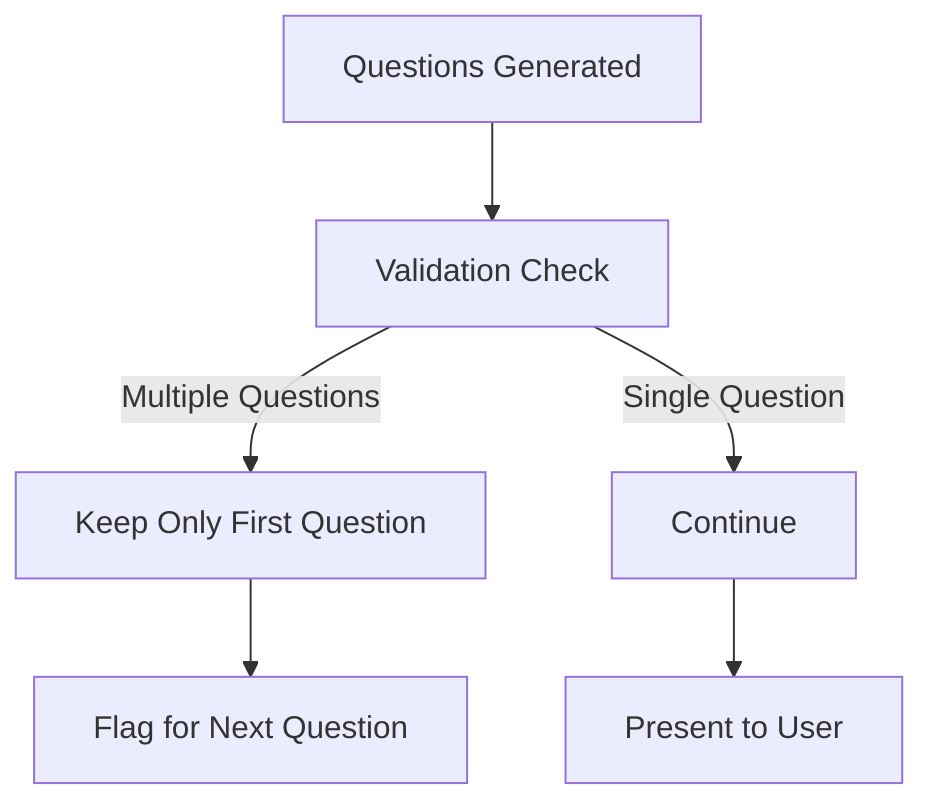
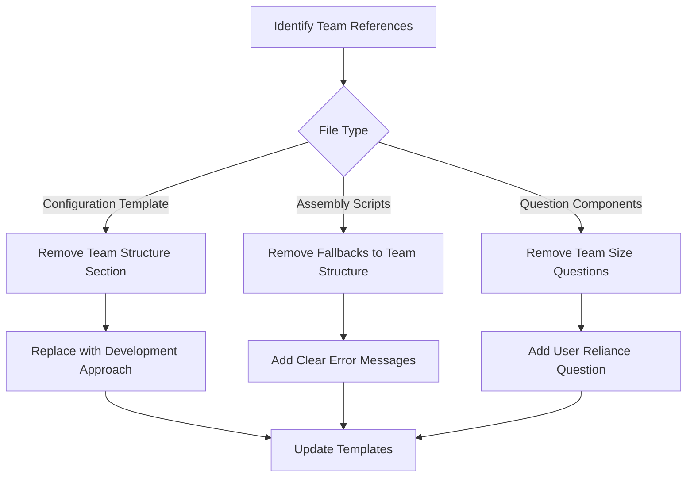
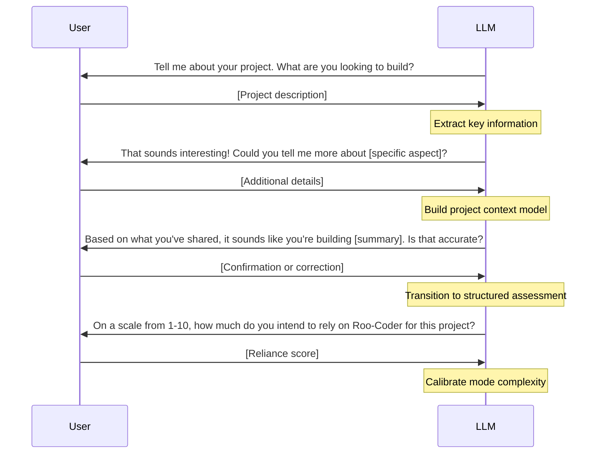
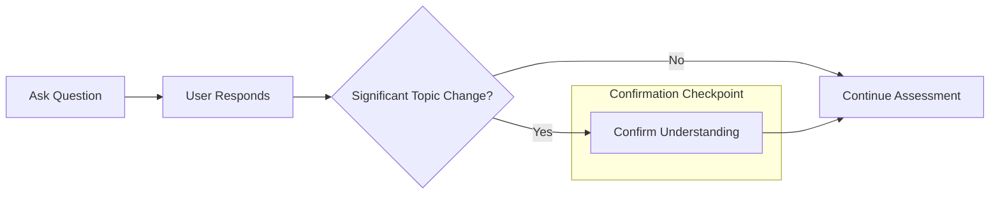
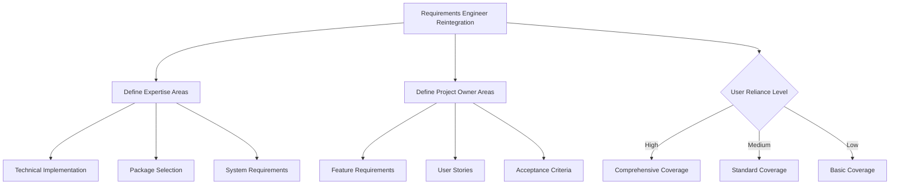
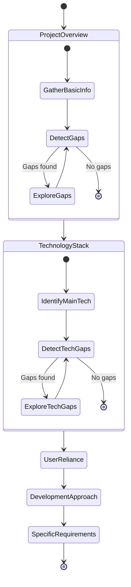

# RooCommander Session Restoration Bugfixes

## Overview

This document outlines specific bugfixes and enhancements to address issues identified in the RooCommander test case and session restoration system. These targeted changes work alongside the broader architectural revisions detailed in `r5-hybrid-lifecycle-technology-modes.md`.

## Identified Issues

1. **Question Grouping**: Questions are being grouped instead of presented one at a time
2. **Team Size Inquiries**: System still asks about team size despite adopting solo-first approach
3. **Missing Pre-conversation**: No gathering of initial project information
4. **Insufficient Pacing**: Lacks confirmation steps and slower pacing
5. **Requirements Engineer Removal**: Valuable expertise area was removed
6. **Rigid Assessment Path**: Too linear and inflexible questioning

## 1. Question Grouping Fix

### Problem
Despite existing directives to present questions one at a time, the system continues to group multiple questions together, creating a poor user experience.

### Root Cause Analysis
The issue persists in several components:
- Directive isn't reinforced in all relevant components
- Question generator lacks validation checks
- Multiple question types might be triggered simultaneously

### Implementation Fix

```javascript
// Add explicit validation before question presentation
const validateQuestionPresentation = (questions) => {
  // Ensure only one question is being presented
  if (questions.length > 1) {
    console.warn("Multiple questions detected - enforcing single question presentation");
    return [questions[0]]; // Only return the first question
  }
  return questions;
};

// Hook into the question generation pipeline
const originalGenerateQuestions = generateQuestions;
generateQuestions = (...args) => {
  const questions = originalGenerateQuestions(...args);
  return validateQuestionPresentation(questions);
};
```

### Component Updates



Add explicit directive to every component that generates questions:

```
mode-selection.txt: "PRESENT questions ONE AT A TIME, never grouped together"
assessment-framework.txt: "ALWAYS present exactly ONE question at a time to the user"
dynamic-mode-generation.txt: "Each question MUST be presented individually, never in groups"
configuration-persistence.txt: "Present assessment questions ONE BY ONE, wait for response"
```

## 2. Team Size Inquiry Fix

### Problem
Despite adopting a solo-first narrative approach, the system still asks about team size and structure.

### Root Cause Analysis
Multiple components still contain team structure references:
- Configuration template includes team structure sections
- Some fallback mechanisms in assembly process reference team structure
- Deprecated components are still being referenced

### Implementation Fix

1. **Remove All Team References**:



2. **Configuration Template Changes**:

```diff
# Project Configuration

## Project Profile
- **Name**: [project_name]
- **Type**: [project_type]
- **Primary Language**: [language]
- **Framework**: [framework] v[version]
...

-## Team Structure
-- **Size**: [size]
-- **Experience Level**: [level]
-- **Key Roles**: [role], [role], [role]

+## Development Approach
+- **Quality/Speed Balance**: [balance]
+- **Experience Level**: [level]
+- **Development Focus**: [focus_areas]
+- **User Reliance Level**: [reliance_score]
```

3. **Rename Terminology**:
   - Change "team structure" to "development approach"
   - Change "roles" to "expertise areas"
   - Update all components to use consistent terminology

## 3. Pre-conversation Implementation

### Problem
Assessment begins with structured questions without establishing initial project context.

### Solution
Create a new component that initiates a friendly conversation about the project:



### Implementation
Create new pre-conversation component:

```
// pre-conversation.txt
BEGIN OPEN-ENDED PROJECT EXPLORATION

Start with warm, conversational greeting and ask about the project broadly.
Example: "Tell me about your project. What are you looking to build?"

After receiving initial response:
1. Extract key information about:
   - Project type/domain
   - Potential technologies
   - Goals and purpose
   
2. Ask follow-up questions about aspects that need clarification
   Example: "That sounds interesting! Could you tell me more about [specific aspect]?"

3. Summarize understanding for confirmation
   Example: "Based on what you've shared, it sounds like you're building [summary]. Is that accurate?"

4. Transition to user reliance assessment
   Example: "On a scale from 1-10, how much do you intend to rely on Roo-Coder for this project?"
   - 1-3: Minimal guidance needed
   - 4-7: Moderate guidance needed
   - 8-10: Comprehensive guidance needed

5. IMPORTANT: Use extracted information to inform subsequent assessment questions
   Example: If user mentions React, tailor questions about frontend accordingly

6. Be conversational, friendly, and inquisitive throughout
END OPEN-ENDED PROJECT EXPLORATION
```

## 4. Pace Improvement with Confirmations

### Problem
Assessment proceeds too quickly without sufficient confirmation steps.

### Solution
Add explicit confirmation checkpoints and slower pacing directives:



### Implementation
Add explicit pacing directives to all components:

```
// assessment-framework.txt addition
CONFIRMATION CHECKPOINTS:
1. After completing each major assessment section
2. Before transitioning to a new topic
3. After receiving complex or detailed responses
4. Before generating final recommendations

CONFIRMATION PATTERN:
"Based on what you've shared about [topic], I understand that [summary]. Is that correct?"

PACING GUIDELINES:
- Present ONE question at a time
- Allow time for user to respond completely
- Always acknowledge the user's response before asking the next question
- Use natural conversational transitions between topics
- Never rush through questions to complete assessment quickly
```

## 5. Requirements Engineer Reintegration

### Problem
Requirements engineer expertise area was removed but is still needed.

### Solution
Reintroduce an enhanced requirements engineer role that:
- Focuses on technical implementation, packages and dependencies
- Adapts its sophistication based on user reliance score
- Works alongside project owner mode for complete requirements coverage

### Implementation



Add to dynamic-mode-generation.txt:

```
REQUIREMENTS EXPERTISE AREAS:

1. Requirements Engineer
   Focus: Technical implementation requirements
   Responsibilities:
   - Package and dependency selection
   - Technical constraints identification
   - System requirements documentation
   - Integration planning
   - Architecture requirements
   
   Calibration based on user reliance:
   - High (8-10): Comprehensive technical documentation, detailed dependency analysis
   - Medium (4-7): Standard technical requirements, common dependency patterns
   - Low (1-3): Basic technical requirements outline

2. Project Owner
   Focus: Feature and business requirements
   Responsibilities:
   - User story creation
   - Acceptance criteria definition
   - Feature prioritization
   - User needs analysis
   
   Calibration based on user reliance:
   - High (8-10): Detailed user stories, comprehensive acceptance criteria
   - Medium (4-7): Standard user stories with basic acceptance criteria
   - Low (1-3): Simple feature listings
```

## 6. Flexible Assessment Path

### Problem
Assessment follows a rigid, linear path regardless of the project's needs.

### Solution
Implement a waypoint system that allows flexible exploration while ensuring key information is gathered:



### Implementation
Add to assessment-framework.txt:

```
WAYPOINT NAVIGATION SYSTEM:

Define essential assessment waypoints:
1. Project Overview
2. Technology Stack
3. User Reliance Level
4. Development Approach
5. Specific Requirements

WAYPOINT BEHAVIOR:
- Each waypoint represents essential information that must be gathered
- Between waypoints, freely explore related topics as needed
- When gaps in understanding are detected, ask targeted questions
- Always return to the assessment path after exploratory branches
- Adjust questioning depth based on project complexity and user responses
- Use summarizations at each waypoint to confirm understanding

EXPLORATORY GUIDELINES:
- Detect information gaps through context analysis
- Generate clarifying questions when ambiguity is detected
- Use open-ended follow-up questions to explore interesting angles
- Allow conversational detours while keeping overall direction
- Maintain friendly, inquisitive tone throughout
```

## Implementation Plan

1. **Update system-prompt-commander**:
   - Add explicit ONE AT A TIME directives
   - Remove all team structure references
   - Add pre-conversation component
   - Add confirmation checkpoint requirements
   - Reintegrate requirements engineer expertise
   - Implement waypoint navigation system

2. **Update Component Files**:
   - Create pre-conversation.txt
   - Modify configuration-persistence.txt to remove team structure
   - Update mode-selection.txt with pacing directives
   - Enhance dynamic-mode-generation.txt with requirements expertise
   - Add waypoint system to assessment-framework.txt

3. **Technical Fixes**:
   - Implement question validation checks
   - Remove fallback mechanisms to team structure
   - Add new component assembly in setup-test.js

These targeted fixes, combined with the broader architectural revisions, will create a more conversational, adaptive, and effective RooCommander that addresses all identified issues while maintaining a cohesive assessment experience.