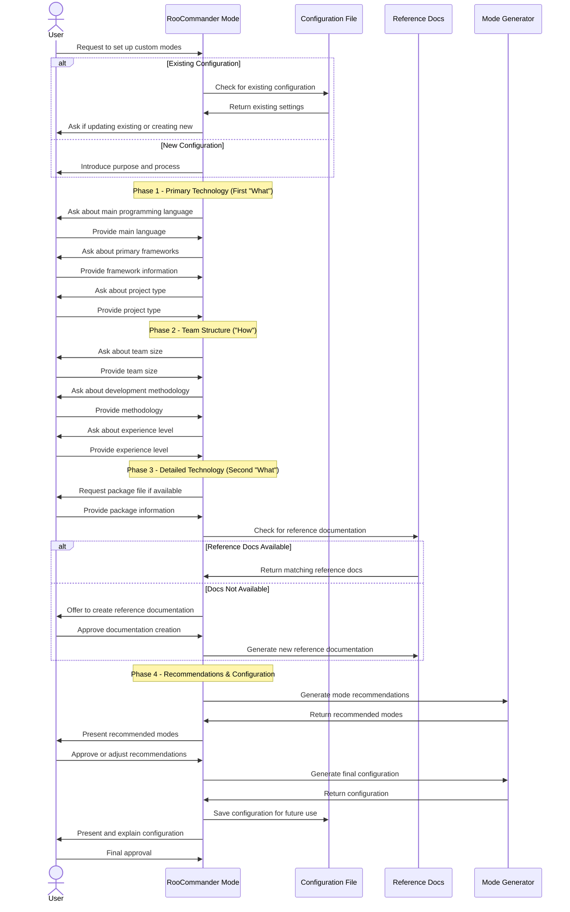
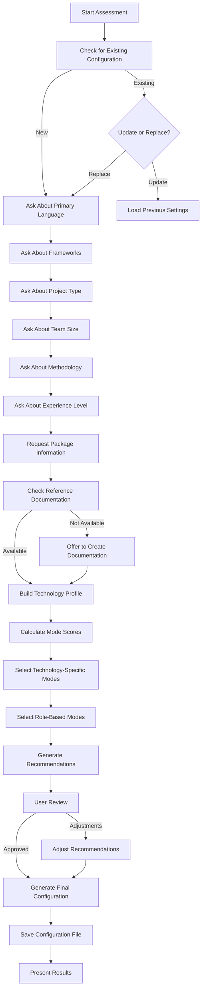
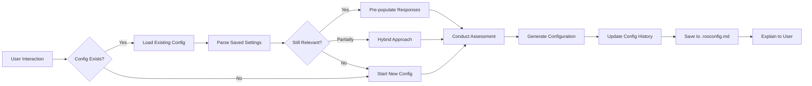
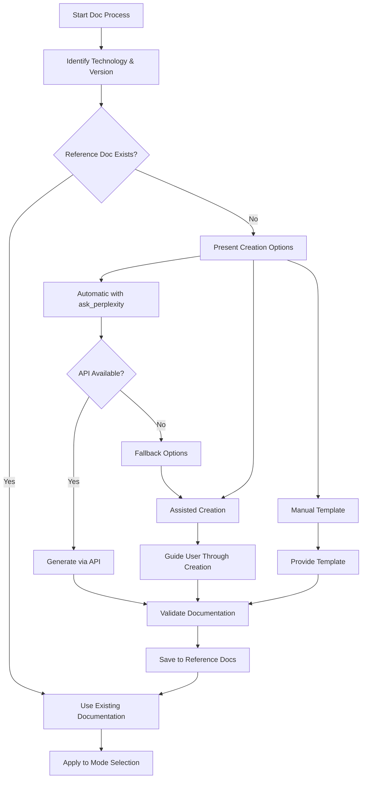
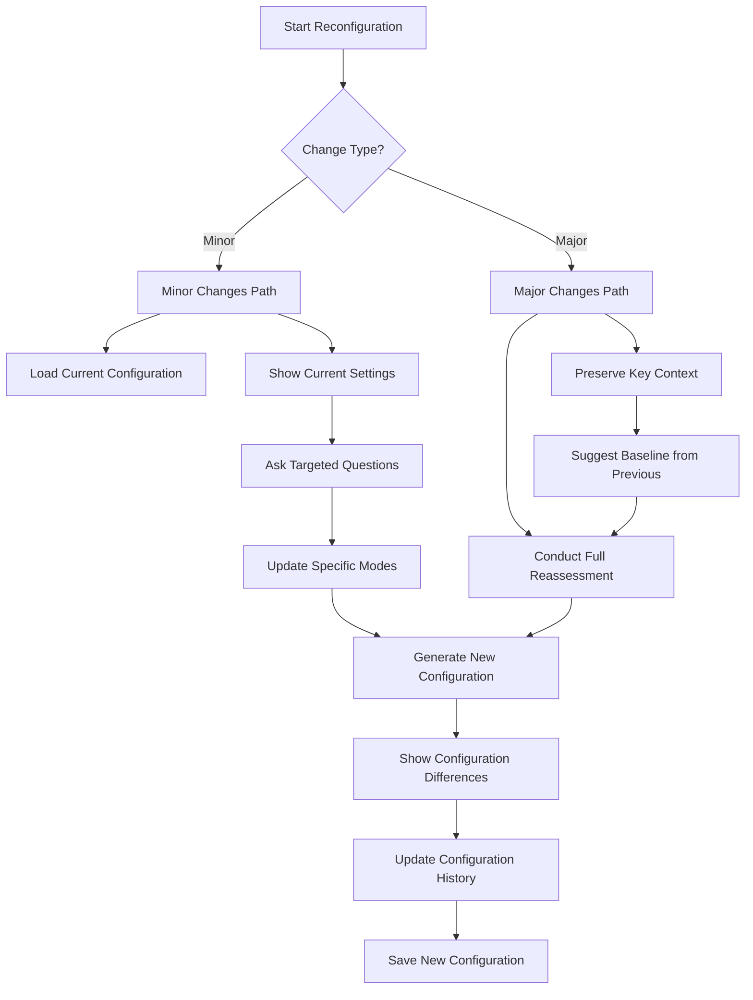

# Revised RooCommander User Flow

This document outlines the revised conversation flow between a user and the RooCommander mode, implementing the "What-How-What" structure and improved configuration management.

## Technology-First Conversation Flow



## Revised Assessment Logic



## Configuration Persistence Management



## Reference Documentation Workflow



## Mode Reconfiguration Scenarios



## Package Analysis Strategy

```mermaid
flowchart LR
    start[Start Analysis] --> sourceIdentify{Source?}
    
    sourceIdentify -->|Package File| parseFile[Parse Package File]
    sourceIdentify -->|User Input| collectInfo[Collect Package Info]
    sourceIdentify -->|Project Scan| scanProject[Scan Project Files]
    
    parseFile & collectInfo & scanProject --> extractCore[Extract Core Dependencies]
    
    extractCore --> versionCheck[Check Versions]
    versionCheck --> compatCheck[Compatibility Analysis]
    compatCheck --> issueDetect{Issues Found?}
    
    issueDetect -->|Yes| severityCheck{Severity?}
    issueDetect -->|No| proceedNormal[Proceed Normally]
    
    severityCheck -->|Critical| blockProceed[Block & Explain]
    severityCheck -->|Warning| warnUser[Warn But Allow]
    severityCheck -->|Info| noteIssue[Note in Recommendations]
    
    blockProceed --> suggestFix[Suggest Fixes]
    warnUser & noteIssue --> techProfile[Build Technology Profile]
    suggestFix --> userDecision{User Decision}
    
    userDecision -->|Override| warnUser
    userDecision -->|Fix| restartCheck[Restart Check]
    
    proceedNormal --> techProfile
    restartCheck --> versionCheck
    
    techProfile --> modeMatch[Match to Technology Modes]
    modeMatch --> customizeInstructions[Customize Mode Instructions]
    customizeInstructions --> complete[Complete Analysis]